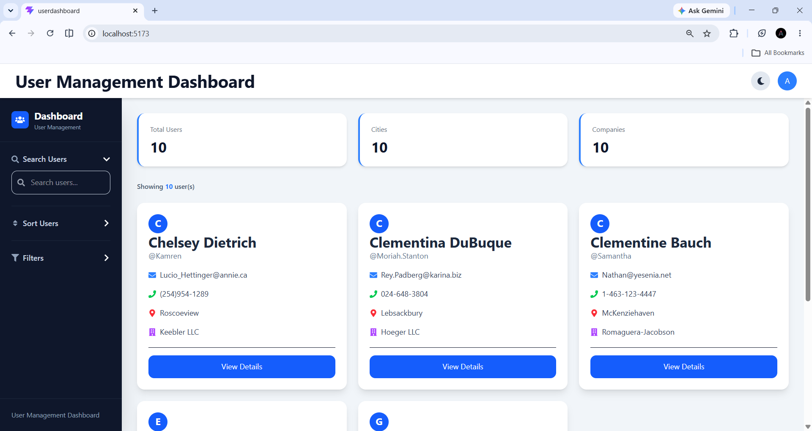
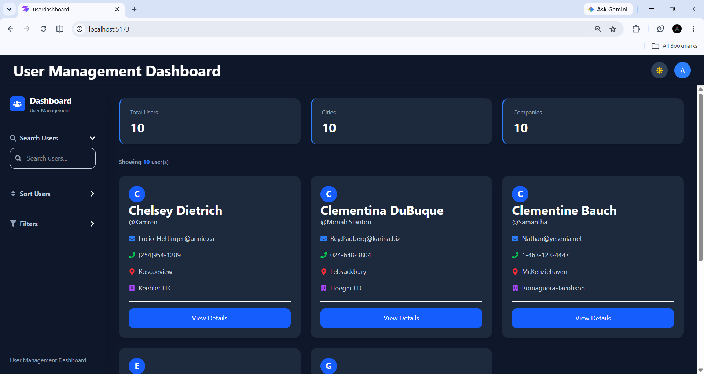
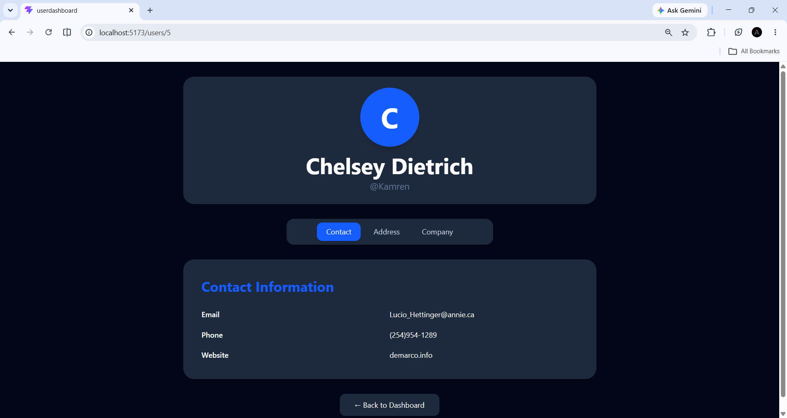
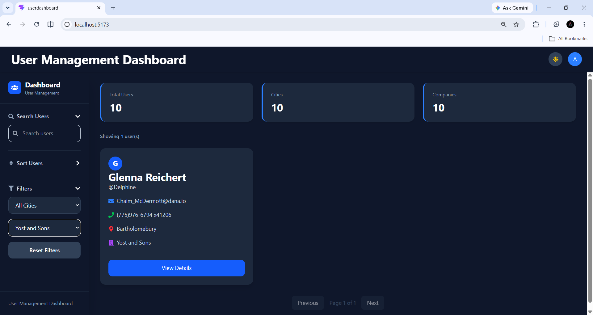

# User Management Dashboard

A modern and responsive User Management Dashboard built using **React**, **TypeScript**, **Tailwind CSS**, and **Vite**. The application fetches user data from an external API and provides advanced features such as searching, sorting, filtering, pagination, dark mode, and detailed user profiles.

---

## Features

* Fetch user data from REST API
* Search users by name, username, or email
* Debounced Search for improved performance
* Sort users by name, username, or email
* Filter users by city and company
* Reset Filters functionality
* Pagination for efficient navigation
* Detailed User Profile Page
* Responsive Design (Mobile, Tablet, Desktop)
* Dark Mode with theme persistence
* Loading Skeletons
* Error Handling
* Search Results Counter
* Lazy Loading using React.lazy and Suspense
* Modern UI with Tailwind CSS

---

## Technologies Used

* React
* TypeScript
* Vite
* Tailwind CSS
* React Router DOM
* React Icons

---

## API Source

User data is fetched from:

https://jsonplaceholder.typicode.com/users

---

## Project Structure

```text
user-management-dashboard/
│
├── public/
│
├── screenshots/
│   ├── dashboard-light.png
│   ├── dashboard-dark.png
│   ├── user-detail.png
│   └── search-filter.png
│
├── src/
│   ├── components/
│   │   ├── Navbar.tsx
│   │   ├── Sidebar.tsx
│   │   ├── SearchBar.tsx
│   │   ├── SortControls.tsx
│   │   ├── FilterControls.tsx
│   │   ├── StatsCards.tsx
│   │   ├── UserCard.tsx
│   │   └── Pagination.tsx
│   │
│   ├── pages/
│   │   ├── UserList.tsx
│   │   └── UserDetail.tsx
│   │
│   ├── routes/
│   │   └── AppRoutes.tsx
│   │
│   ├── services/
│   │   └── UserServices.ts
│   │
│   ├── types/
│   │   └── User.ts
│   │
│   ├── App.tsx
│   └── main.tsx
│
├── README.md
├── package.json
├── tsconfig.json
├── vite.config.ts
└── tailwind.config.js
```

---

## Screenshots

### Dashboard - Light Mode



### Dashboard - Dark Mode



### User Detail Page



### Search and Filter



---

## Installation

### Clone the Repository

```bash
git clone https://github.com/AnnEldho/Project.git
```

### Navigate to Project Directory

```bash
cd UserDashboard
```

### Install Dependencies

```bash
npm install
```

### Start Development Server

```bash
npm run dev
```

### Build for Production

```bash
npm run build
```

### Preview Production Build

```bash
npm run preview
```

---

## Performance Optimizations

* Debounced Search using useEffect
* Memoization using useMemo
* Lazy Loading using React.lazy and Suspense
* Efficient state management with React Hooks
* Client-side Pagination

---

## Future Enhancements

* Unit Testing with Jest and React Testing Library
* CSV Export
* Favorites Feature
* User Editing Functionality
* Authentication and Authorization
* Charts and Analytics Dashboard

---

## Author

**Ann Mary Eldho**

Built as part of a React + TypeScript User Management Dashboard Assessment.
